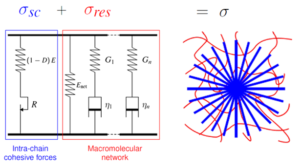

# VEPD Detrez 2010

[`VEPD_Detrez2010`](@ref) is a finite-strain viscoelastic-plastic damage model (`src/models/VEPD_Detrez2010.jl`), implemented from a C reference [2] and adapted with Julia-specific integration choices.
It couples a St. Venant–Kirchhoff crystalline phase, an Arruda–Boyce network phase, multiple Maxwell branches, and isotropic hardening with damage.
Figure 1 sketches its rheological layout.



**Figure 1.** *Rheological representation of the VEPD Detrez 2010 model with crystalline elasto-plastic damage, equilibrium network, and Maxwell branch contributions.*

### Mathematical formulation

Detrez et al. [1] split the free energy and dissipation into an intra-lamellar crystalline contribution and an entropic-network contribution as
```math
\varphi = \varphi^{\mathrm{cs}} + \varphi^{\mathrm{net}},
\qquad
\phi = \phi^{\mathrm{cs}} + \phi^{\mathrm{net}}
```
with $\varphi$ denoting the free energy and $\phi$ the dissipation potential.
The Cauchy stress is assembled as the sum of the crystalline cohesive stress, the equilibrium network stress, and the Maxwell-branch stresses as
```math
\boldsymbol{\sigma}
=
\boldsymbol{\sigma}^{\mathrm{cs}}
+ \boldsymbol{\sigma}^{\mathrm{net}}
+ \boldsymbol{\sigma}^{\mathrm{visco}} \text{.}
```

#### 1. Crystalline phase with plasticity and damage

The crystalline cohesive part uses the multiplicative split
```math
\boldsymbol{F}
=
\boldsymbol{F}^{\mathrm{e}}\boldsymbol{F}^{\mathrm{p}},
\qquad
\boldsymbol{C}^{\mathrm{e}}
=
\left[\boldsymbol{F}^{\mathrm{e}}\right]^T\boldsymbol{F}^{\mathrm{e}}, \quad\text{and}
\qquad
\boldsymbol{E}^{\mathrm{e}}
=
\frac{1}{2}\left[\boldsymbol{C}^{\mathrm{e}}-\boldsymbol{I}\right] \text{.}
```
Here, $\boldsymbol{F}$ is the total deformation gradient,
$\boldsymbol{F}^{\mathrm{e}}$ and $\boldsymbol{F}^{\mathrm{p}}$ are its
elastic and plastic parts, $\boldsymbol{C}^{\mathrm{e}}$ is the elastic
right Cauchy-Green tensor, $\boldsymbol{E}^{\mathrm{e}}$ is the elastic
Green-Lagrange strain, and $\boldsymbol{I}$ is the identity tensor. The
operators $\operatorname{tr}(\cdot)$ and $\operatorname{dev}(\cdot)$
denote the trace and deviatoric part.

With Lamé parameters $\lambda_E$ and $\mu_E$ computed from the
crystalline Young's modulus `E` and Poisson's ratio `ν`, the damage-free
crystalline second Piola-Kirchhoff stress renders as
```math
\boldsymbol{S}^{\mathrm{c}}
=
\lambda_{\mathrm{E}}\operatorname{tr}(\boldsymbol{E}^{\mathrm{e}})\boldsymbol{I}
+ 2\mu_{\mathrm{E}}\boldsymbol{E}^{\mathrm{e}} \text{,}
```

while the scalar damage variable $D$ follows the plastic strain coupling
of Detrez et al. [1]. With accumulated plastic strain $p$ and damage
parameters $\alpha$ and $\beta$, the Julia value is capped at full damage,
```math
D(p)
=
\min\left(1,\alpha\left[1-e^{-\beta p}\right]\right) \text{.}
```

The crystalline Cauchy stress is
```math
\boldsymbol{\sigma}^{\mathrm{cs}}
=
\left[1-D\right]\frac{1}{J^{\mathrm{e}}}
\boldsymbol{F}^{\mathrm{e}}\boldsymbol{S}^{\mathrm{c}}\left[\boldsymbol{F}^{\mathrm{e}}\right]^T \text{.}
```

The denominator $J^{\mathrm{e}}=\det\boldsymbol{F}^{\mathrm{e}}$ is the elastic Jacobian – the volume change between the intermediate and the reference configuration.
The implementation keeps both factors explicit: the crystalline Cauchy stress is scaled by $\left[1-D\right]$ and divided by $J^{\mathrm{e}}$ in the push-forward.

Plastic loading is checked with the elastically rescaled Mandel stress
```math
\widetilde{\boldsymbol{\Sigma}}
=
\frac{\boldsymbol{C}^{\mathrm{e}}\boldsymbol{S}^{\mathrm{c}}}{J^{\mathrm{e}}}
\qquad\text{and}\quad
\widetilde\Sigma_{\mathrm{eq}}
=
\sqrt{\frac{3}{2}
\operatorname{dev}\widetilde{\boldsymbol{\Sigma}}: \operatorname{dev}\widetilde{\boldsymbol{\Sigma}}} \text{.}
```

The factor $1/J^{\mathrm{e}}$ rescales the elastic Mandel stress $\boldsymbol{C}^{\mathrm{e}}\boldsymbol{S}^{\mathrm{c}}$ to the same volumetric frame as $\boldsymbol{\sigma}^{\mathrm{cs}}$, so the yield residual $f$ compares consistent state forces.

With initial yield stress $R_0$, saturation modulus $Q$, and saturation
exponent $b$, the hardening stress $R(p)$ and yield residual $f$ are
```math
R(p)
=
R_0 + Q\left[1-e^{-bp}\right],
\qquad\text{and}\quad
f
=
\widetilde\Sigma_{\mathrm{eq}} - R(p) \le 0 \text{.}
```

For `plastic_update=:end_step`, when $f > 10^{-9}E$, a scalar Newton problem is solved for $\Delta p$ and the plastic deformation gradient is updated with the linear plastic map
```math
\boldsymbol{F}^{\mathrm{p}}_{n+1}
=
\left[\boldsymbol{I}+\Delta p\,\boldsymbol{N}\right]\boldsymbol{F}^{\mathrm{p}}_{n},
\qquad
\boldsymbol{N}
=
\frac{3}{2}\frac{\operatorname{dev}\widetilde{\boldsymbol{\Sigma}}}
{\widetilde\Sigma_{\mathrm{eq}}} \text{,}
\qquad\text{and}\quad
p_{n+1}=p_n+\Delta p \text{.}
```
Here, $\boldsymbol{N}$ is the plastic flow direction, index $n$ marks the
start-of-step state, and $n+1$ the end-of-step state of an incremental
update over $\Delta t$.
With `plastic_update=:path_substepped`, the deformation change over the global time step is split into 8 linear subincrements, and the scalar plastic return solve is applied successively at the end of each subincrement.

#### 2. Equilibrium network stress

The Arruda–Boyce network contribution is evaluated from the isochoric first invariant
```math
\bar{I}_1
=
J^{-2/3}\operatorname{tr}\boldsymbol{C} \text{,}
\qquad\text{where}\quad
\boldsymbol{C} = \boldsymbol{F}^T\boldsymbol{F}
\quad\text{and}\quad
J=\det\boldsymbol{F}
```
with $J$ as the total Jacobian and $\boldsymbol{C}$ as the total right Cauchy-Green tensor.

The derivative of the truncated Arruda–Boyce energy is
```math
\frac{\partial W}{\partial\bar{I}_1}
=
\mu_{\mathrm{ab}}
\left[
\frac{1}{2}
+ \frac{\bar{I}_1}{10n_{\mathrm{ab}}}
+ \frac{11\bar{I}_1^2}{350n_{\mathrm{ab}}^2}+ \frac{19\bar{I}_1^3}{1750n_{\mathrm{ab}}^3} + \frac{519\bar{I}_1^4}{134750n_{\mathrm{ab}}^4} \right]
```
where $W$ is the network energy, $\mu_{\mathrm{ab}}$ is the network shear
modulus, and $n_{\mathrm{ab}}$ is the number of Kuhn segments per chain.

The corresponding second Piola-Kirchhoff stress is
```math
\boldsymbol{S}^{\mathrm{net}}
=
2\frac{\partial W}{\partial\bar{I}_1}
J^{-2/3}
\left[
\boldsymbol{I}- \frac{1}{3}\operatorname{tr}(\boldsymbol{C})\boldsymbol{C}^{-1} \right] \text{.}
```

This network contribution is kept deviatoric after push-forward as
```math
\boldsymbol{\sigma}^{\mathrm{net}}
=
\operatorname{dev}
\left(\frac{1}{J} \boldsymbol{F}\boldsymbol{S}^{\mathrm{net}}\boldsymbol{F}^T \right) \text{.}
```

#### 3. Viscoelastic Maxwell branches

Detrez et al. [1] write the Maxwell branch evolution in rate form as
```math
\overset{\nabla}{\boldsymbol{\sigma}}_i
+ \frac{1}{\tau_i}\boldsymbol{\sigma}_i
=
G_i\,\mathbb{J}:\boldsymbol{D} \text{,}
```
where the over-nabla denotes the objective stress rate, $i$ is the
Maxwell-branch index, $G_i$ the branch shear modulus, $\tau_i$ the branch
relaxation time, $\mathbb{J}$ the deviatoric projection,
$\boldsymbol{D}$ the rate-of-deformation tensor, and
$\boldsymbol{\sigma}_i$ the per-branch Cauchy stress.
The code-level reference [2] integrates this rate equation with a fourth-order Runge-Kutta scheme, while this implementation exposes two Maxwell-branch update choices:
The default `maxwell_update=:closed_form_cv` uses a closed-form update for
the per-branch viscous metric, where
$\boldsymbol{C}^{\mathrm{v}}_{i,n}$ is branch $i$'s start-of-step viscous
right Cauchy-Green tensor, $\Delta t$ is the time increment, and
$\boldsymbol{C}_{n+1}=\boldsymbol{F}_{n+1}^T\boldsymbol{F}_{n+1}$ is the
total right Cauchy-Green tensor at end-of-step, reading
```math
\boldsymbol{C}^{\mathrm{v}}_{i,n+1}
=
e^{-\Delta t/\tau_i}\boldsymbol{C}^{\mathrm{v}}_{i,n}
+ \left[1-e^{-\Delta t/\tau_i}\right]\boldsymbol{C}_{n+1} \text{.}
```

The branch stresses are then assembled as
```math
\boldsymbol{\sigma}^{\mathrm{visco}}
=
\sum_iG_i\operatorname{dev}\left(\boldsymbol{F}\left[\boldsymbol{C}^{\mathrm{v}}_{i,n+1}\right]^{-1} \boldsymbol{F}^T \right) \text{.}
```
With the optional `maxwell_update=:objective_rate`, the per-branch Cauchy stress from the rate equation above is instead advanced with a fixed 16-substep fourth-order Runge-Kutta objective-rate update.

## Implementation details

`VEPD_Detrez2010State` stores the deformation gradient, plastic deformation gradient, accumulated plastic strain $p$, and per-branch viscous right Cauchy-Green tensors $\boldsymbol{C}_{\mathrm{v},i}$ as `current_*` end-of-step values and `previous_*` committed start-of-step values; branch stresses are additionally stored for `maxwell_update=:objective_rate`.

The tangent is obtained via automatic differentiation (`Tensors.gradient`) over the local stress update.

The local integration uses a return mapping algorithm: a Newton–Raphson iteration on the yield residual, stopped at `1e-9 * E`, combined with the selected Maxwell-branch update.
If the return mapping does not converge, [`VEPD_Detrez2010ConvergenceError`](@ref) is thrown; adaptive outer solvers can catch this via [`try_stiffness_matrix`](@ref) and reduce the time step with [`TimeStepController`](@ref) or an equivalent policy.

## Constructor

```julia
# Positional constructor
VEPD_Detrez2010(E, ν, R0, Q, b, α, β, n_ab, μ_ab, G, τ;
           plastic_update=:end_step,
           maxwell_update=:closed_form_cv)
```

The `plastic_update` and `maxwell_update` keyword arguments are optional (omit them for simple tests).
`G` and `τ` are vectors with one entry per Maxwell branch.
They must have the same length, and every relaxation time in `τ` must be positive.

The keyword-controlled update modes are as follows:

| Keyword | Values | Meaning |
| --- | --- | --- |
| `plastic_update` | `:end_step` | One plastic return map using the end-of-step deformation (default) |
| `plastic_update` | `:path_substepped` | The same return map applied over 8 linear deformation-path subincrements |
| `maxwell_update` | `:closed_form_cv` | Closed-form update of $\boldsymbol{C}^{\mathrm{v}}$, the viscous right Cauchy-Green branch state (default) |
| `maxwell_update` | `:objective_rate` | Fixed 16-substep fourth-order Runge-Kutta objective-rate update of the Maxwell branch Cauchy stresses |

The default `plastic_update=:end_step, maxwell_update=:closed_form_cv` is the fastest option.
Use `:path_substepped` when plasticity and damage evolve strongly over coarse time increments, and consider `:objective_rate` when the Maxwell response behaves highly time step dependent.
The plastic path-substepping count is hardcoded to 8; the Maxwell objective-rate substep count is hardcoded to 16.
The non-default update modes add significant work per quadrature point, but can reduce sensitivity to coarse time stepping.
If the calibrated response depends strongly on the loading history, it's recommended to test and compare the keyword-controlled update modes in identical load cases.

## 2D usage

```julia
material = PlaneStress(VEPD_Detrez2010(E, ν, R0, Q, b, α, β, n_ab, μ_ab, G, τ))
material = PlaneStrain(VEPD_Detrez2010(E, ν, R0, Q, b, α, β, n_ab, μ_ab, G, τ))
```
Both wrappers run through the model's own `compute_PK1_3D` and `update_state_from_3D!` methods, which the finite-strain kinematics require.
The keyword-controlled update modes apply unchanged under both wrappers.
For wrapper mechanics, see [Wrappers](../wrappers.md).

## Model parameters

| Group | Constructor argument | Description |
| --- | --- | --- |
| Elasticity | `E` | Young's modulus of the crystalline phase |
| Elasticity | `ν` | Poisson's ratio of the crystalline phase |
| Isotropic hardening | `R0` | Initial yield stress; higher values delay the onset of plasticity |
| Isotropic hardening | `Q` | Saturation modulus; higher values raise the asymptotic hardening limit |
| Isotropic hardening | `b` | Saturation exponent; larger values cause the yield stress to plateau at smaller plastic strains |
| Damage | `α` | Damage scaling factor; sets the asymptotic damage level (value is capped at 1 in Julia) |
| Damage | `β` | Damage exponent; larger values accelerate damage accumulation with plastic strain |
| Arruda–Boyce network | `n_ab` | Number of Kuhn segments per chain; larger values soften the network at moderate stretches and push locking to higher stretches |
| Arruda–Boyce network | `μ_ab` | Network shear modulus; scales the Arruda–Boyce network stress contribution |
| Maxwell branches | `G` | Vector of branch shear moduli; higher values raise the branch elastic stiffness |
| Maxwell branches | `τ` | Vector of branch relaxation times; larger values delay branch equilibration |
| Integration option | `plastic_update` | Selects end-step or path-substepped plastic return mapping |
| Integration option | `maxwell_update` | Selects closed-form $\boldsymbol{C}^{\mathrm{v}}$ or objective-rate Maxwell update |

## Provenance and acknowledgements

The code-level reference is an unpublished C implementation provided by Fabrice Detrez [2].
Fabrice Detrez gave explicit permission to use and translate that reference for the open-source FerriteSolidMechanics.jl implementation.

The implementation is maintained by Lukas Laubert.
Fabrice Detrez is gratefully acknowledged for providing the original C implementation and rheological layout figure, for proofreading this page, and for clarifying details about the model formulation and parameterization.

## Main differences from the reference

- The tangent modulus is obtained via automatic differentiation (`Tensors.gradient`) instead of using a pre-derived analytical stiffness.
- The `plastic_update` and `maxwell_update` keyword options on the Julia constructor have no equivalent in the C routine [2].
<!--- - The equilibrium network is the Arruda–Boyce/Cohen-series contribution above, while the optional C-reference network penalty, alternative `HE_POTENTIALJ` plug-ins, and `vd` time-scaling parameter are not constructor fields.--->

## See also

- [Developer guide](../developer_guide.md) – for the general material hooks.
- [Wrappers](../wrappers.md) – for 2D usage.
- Experimental variants: `VEPD_Detrez2010_Optimized`, `VEPD_Detrez2010_Implicit`,
  `VEPD_Detrez2010_ExactVisco`, `VEPD_Detrez2010_ClosedCVEndStep`
  (see [Experimental models](../experimental.md)).


## References

[1] Detrez, F., Cantournet, S., & Séguéla, R. (2010). A constitutive model for semi-crystalline polymer deformation involving lamellar fragmentation. *Comptes Rendus Mécanique*, 338(12), 681–687. [doi:10.1016/j.crme.2010.10.008](https://doi.org/10.1016/j.crme.2010.10.008)

[2] Code-level reference for the Julia implementation in this package is an unpublished C routine that was kindly provided by Fabrice Detrez.
