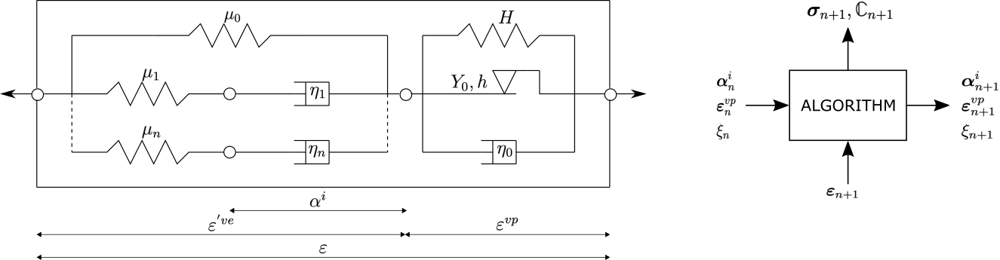

# VEVP MOAMMM

[`VEVP_MOAMMM`](@ref) is a finite-strain viscoelastic–viscoplastic model with a logarithmic strain formulation, a Drucker–Prager yield surface, isotropic hardening through separate compression and tension yield stress evolution, and kinematic hardening.
The implementation is translated from the Fortran reference [2] and is available in `src/models/VEVP_MOAMMM.jl`.
Figure 1 sketches the rheological layout used by the model.



**Figure 1.** *Rheological representation of the VEVP MOAMMM model with generalized Maxwell branches coupled to Drucker-Prager/Perzyna viscoplasticity; shown in small-strain notation.*

### Mathematical formulation

The model comprises a generalized Maxwell viscoelastic part: an equilibrium branch and $n$ non-equilibrium Maxwell branches act in parallel, while each Maxwell branch contains its spring-dashpot pair in series.
This viscoelastic part is coupled to the viscoplastic part through the multiplicative split of the deformation gradient.

#### 1. Viscoelastic part
The model uses a logarithmic strain measure, namely the Hencky strain $\boldsymbol{E}_{(0)}^\mathrm{ve}$, defined from the elastic right Cauchy-Green tensor $\boldsymbol{C}^e$ as
```math
\boldsymbol{E}_{(0)}^\mathrm{ve} = \frac{1}{2}\ln{\boldsymbol{C}^e} \text{.}
```
Here, $\boldsymbol{C}^e=\left[\boldsymbol{F}^e\right]^T\boldsymbol{F}^e$ uses the elastic deformation gradient $\boldsymbol{F}^e$, and $J^\mathrm{ve}=\det\boldsymbol{F}^e=\sqrt{\det\boldsymbol{C}^e}$ is the elastic volume ratio used below.
The operators $\operatorname{tr}(\cdot)$ and $\operatorname{dev}(\cdot)$ denote the trace and deviatoric part.
Each viscoelastic branch $j \in \{\infty, 1, \dots, n\}$ is assigned a bi-logarithmic quadratic potential function for the springs, with branch bulk modulus $K_j$ and shear modulus $G_j$, given as
```math
\psi_j(\boldsymbol{E}_{(0)}^\mathrm{ve}) = \frac{K_j}{2}\ln^2J^\mathrm{ve} + G_j [\mathrm{dev}\,\boldsymbol{E}_{(0)}^\mathrm{ve} : \mathrm{dev}\,\boldsymbol{E}_{(0)}^\mathrm{ve}] \text{,}
```
and a quadratic dissipation function for the dashpots, governing the evolution of the internal variables $\boldsymbol{q}_j$.
The evolution of the volumetric and deviatoric parts of $\boldsymbol{q}_j$ is respectively defined by the volumetric and deviatoric relaxation times ${\tau_\mathrm{k}}_j$ and ${\tau_\mathrm{g}}_j$ as
```math
\mathrm{tr}\,\dot{\boldsymbol{q}}_j = \frac{3K_j}{{\tau_\mathrm{k}}_j}\mathrm{tr}\,\boldsymbol{E}_{(0)}^\mathrm{ve} - \frac{1}{{\tau_\mathrm{k}}_j}\mathrm{tr}\,\boldsymbol{q}_j \quad\text{and}
```
```math
\mathrm{dev}\,\dot{\boldsymbol{q}}_j = \frac{2G_j}{{\tau_\mathrm{g}}_j}\mathrm{dev}\,\boldsymbol{E}_{(0)}^\mathrm{ve} - \frac{1}{{\tau_\mathrm{g}}_j}\mathrm{dev}\,\boldsymbol{q}_j \text{,}
```
while the overdot denotes a material time derivative.
The conjugate viscoelastic stress measure is the corotational Kirchhoff stress $\boldsymbol{\tau}$, assembled from the equilibrium branch ($\infty$) and the non-equilibrium Maxwell branches as
```math
\boldsymbol{\tau} = \boldsymbol{\tau}_\infty^0 + \sum_{j=1}^{n}\left[ \boldsymbol{\tau}_j^0 - \boldsymbol{q}_j \right] \text{,} \quad \text{where } \boldsymbol{\tau}_j^0 = \frac{\partial\psi_j}{\partial\boldsymbol{E}_{(0)}^\mathrm{ve}} \text{.}
```

The Julia port follows the UMAT integration variables rather than storing the stress-like $\boldsymbol{q}_j$ of Nguyen et al. [1] directly.
For each branch it stores a deviatoric tensor `AA[j]` and a volumetric scalar `BB[j]`, updated in closed form from the logarithmic strain increment as
```math
\boldsymbol{A}_{j,n+1}
=
e^{-\Delta t/\tau_{g,j}}\boldsymbol{A}_{j,n}
+ e^{-\Delta t/\left[2\tau_{g,j}\right]}
\operatorname{dev}(\boldsymbol{E}^{\mathrm{ve}}_{n+1}
- \boldsymbol{E}^{\mathrm{ve}}_n) \quad\text{and}
```
```math
B_{j,n+1}
=
e^{-\Delta t/\tau_{k,j}}B_{j,n}
+ e^{-\Delta t/\left[2\tau_{k,j}\right]}
\operatorname{tr}(\boldsymbol{E}^{\mathrm{ve}}_{n+1}
- \boldsymbol{E}^{\mathrm{ve}}_n) \text{.}
```
Here, $\boldsymbol{A}_j$ and $B_j$ denote the mathematical branch variables stored as `AA[j]` and `BB[j]`, while $\boldsymbol{E}^{\mathrm{ve}}_n$ and $\boldsymbol{E}^{\mathrm{ve}}_{n+1}$ are the start-of-step and end-of-step logarithmic strains, and $\Delta t$ the time increment.

The code evaluates this update first with the trial viscoelastic strain increment for the yield check and, if viscoplastic flow occurs, again with the converged strain increment for the stored state.

In the stress assembly, `AA[j]` enters the deviatoric branch stress as `2 GG[j] AA[j]`, while `BB[j]` enters the volumetric branch stress as `KK[j] BB[j] I` (trace `3 KK[j] BB[j]`).

#### 2. Viscoplastic part
Beyond the elastic limit, viscoplastic flow is triggered.
The model uses a combined stress measure $\boldsymbol{\phi} = \boldsymbol{\tau} - \boldsymbol{b}$, where $\boldsymbol{b}$ is the corotational backstress tensor for kinematic hardening.

The yield function $\mathcal{F}$ is a generalized Drucker-Prager condition, written as a linear combination of the mean stress $\phi_\mathrm{pr}=\operatorname{tr}(\boldsymbol{\phi})/3$ and the von Mises equivalent stress $\phi_\mathrm{eq}=\sqrt{\frac{3}{2}\operatorname{dev}\boldsymbol{\phi}:\operatorname{dev}\boldsymbol{\phi}}$ as
```math
\mathcal{F}(\boldsymbol{\phi}) = a_2[\phi_\mathrm{eq}]^\alpha - a_1 \phi_\mathrm{pr} - a_0 \text{.}
```
Here, $\alpha$ is the yield exponent, and the coefficients $a_2, a_1, a_0$ depend on the tension-compression asymmetry ratio and the current yield stresses for compression and tension, $\sigma_\mathrm{c}$ and $\sigma_\mathrm{t}$.

To enable the accurate prediction of the Poisson effect during plastic deformation, a non-associated Perzyna-type viscoplastic flow rule $\boldsymbol{D}^\mathrm{vp}$ is used, defined by the gradient of a quadratic flow potential $P$ by
```math
P = [\phi_\mathrm{eq}]^2 + \beta[ \phi_\mathrm{pr}]^2 \text{,}
```
where the parameter $\beta$ is derived from the plastic Poisson's ratio $\nu_\mathrm{p}$ as $\beta = \frac{9}{2}\frac{1-2\nu_\mathrm{p}}{1+\nu_\mathrm{p}}$.
The viscoplastic flow rate is then given by
```math
\boldsymbol{D}^\mathrm{vp} = \frac{1}{\eta}\langle\mathcal{F}\rangle^{\frac{1}{p}}\frac{\partial{P}}{\partial\boldsymbol{\tau}}
```
with the viscoplastic coefficient $\eta$, the viscoplastic exponent $p$, and the Macaulay bracket $\langle x\rangle=\max(x,0)$.
The equivalent plastic strain $\gamma$ evolves according to
```math
\dot{\gamma} = \frac{1}{\sqrt{1 + 2 \nu_\mathrm{p}^2}} \sqrt{\boldsymbol{D}^\mathrm{vp} : \boldsymbol{D}^\mathrm{vp}} \text{.}
```

The translated implementation evaluates the compression and tension yield stresses directly as functions of the equivalent plastic strain:
```math
\sigma_\mathrm{c}(\gamma)
=
\sigma_\mathrm{c}^0
+ h_{c1}\gamma+ h_{c2}\left[1-e^{-h_{c,\exp}\gamma}\right] \quad\text{and}
```
```math
\sigma_\mathrm{t}(\gamma)
=
\sigma_\mathrm{t}^0
+ h_{t1}\gamma
+ h_{t2}\left[1-e^{-h_{t,\exp}\gamma}\right] \text{.}
```
Here, $\sigma_\mathrm{c}^0$ and $\sigma_\mathrm{t}^0$ are the initial compression and tension yield stresses; $h_{c1}$ and $h_{t1}$ are linear hardening coefficients, $h_{c2}$ and $h_{t2}$ are saturation magnitudes, and $h_{c,\exp}$ and $h_{t,\exp}$ are saturation exponents.

Kinematic hardening follows a polynomial factor in the equivalent plastic strain.
In the translated update this factor is evaluated from the start-of-step plastic strain $\gamma_0$ using

```math
\dot{\boldsymbol{b}}
=
\left[h_\mathrm{b0}
+ h_\mathrm{b1}\gamma_0+ h_\mathrm{b2}\gamma_0^2\right]\boldsymbol{D}^\mathrm{vp} \text{.}
```
The coefficients $h_\mathrm{b0}$, $h_\mathrm{b1}$, and $h_\mathrm{b2}$ are the constant, linear, and quadratic kinematic hardening factors.

## Implementation details

### State layout
`VEVP_MOAMMMState` stores the quadrature point state as typed fields rather than as one flat state vector.
Each state variable is stored as a trial value and a committed start-of-step value: the `current_*` fields hold the state written after each constitutive update, and the matching `previous_*` fields are saved by `update_state!` and restored by `revert_state!`.
The stored variables follow the original Fortran UMAT state-variable set [2] but are represented explicitly: `Fvp` stores the plastic deformation gradient, `Eve` stores the elastic logarithmic strain, `gma` stores the equivalent plastic strain, `b` stores the corotational backstress tensor, and the per-branch fields `AA[j]` and `BB[j]` store the deviatoric viscoelastic branch tensor and volumetric branch scalar for each Maxwell branch.

### Tangent and local integration
The quadrature point constitutive update performs a Newton–Raphson solve along the Perzyna flow law:
It solves the overstress consistency equation for the viscoplastic multiplier, unless the trial state already satisfies Perzyna consistency `ft ≤ 1e-11`, in which case the predictor is accepted directly without entering the loop.
The Newton loop has a fixed budget of `maxiter = 500` iterations with a tolerance of `1e-11` on the residual `f`.
If this budget is exhausted, [`VEVP_MOAMMMConvergenceError`](@ref) is thrown, and adaptive outer solvers can catch it via [`try_stiffness_matrix`](@ref) to reduce the time step with [`TimeStepController`](@ref) or an equivalent policy.

The tangent is obtained via automatic differentiation (`Tensors.gradient`), replacing the finite-difference perturbation of the original Fortran UMAT [2].

### Logarithmic strain

The local constitutive update (`material_response`) uses a polynomial approximant of `log` for the elastic right Cauchy-Green tensor $\boldsymbol{C}^e=\left[\boldsymbol{F}^e\right]^T\boldsymbol{F}^e$ and a polynomial approximant of `exp` for the plastic flow-map update.
Both are controlled by the `order` parameter (see the Model parameters table for the trade-off between approximation accuracy and per-step cost).

## Constructor

```julia
VEVP_MOAMMM(order, KK_inf, GG_inf, alpha, nu_p, eta, p_exp,
              sigmac0, hc1, hc2, hcexp,
              sigmat0, ht1, ht2, htexp,
              hb0, hb1, hb2,
              KK, k, GG, g)
```

The number of Maxwell branches is inferred from the length of the four branch parameter vectors (`KK`, `k`, `GG`, `g`); all four must have the same length.
Passing empty vectors sets `nbr = 0`, disabling the Maxwell branches.
The constructor raises an `ArgumentError` if the vector lengths disagree or if `eta` or `p_exp` are non-positive.

## 2D usage

```julia
mp = VEVP_MOAMMM(order, KK_inf, GG_inf, ...)  # the 22 positional arguments listed above
material = PlaneStress(mp)
material = PlaneStrain(mp)
```
Both wrappers run through the model's own `compute_PK1_3D` and `update_state_from_3D!` methods, which the finite-strain kinematics require.
For wrapper mechanics, see [Wrappers](../wrappers.md).

## Model parameters

| ID | Constructor argument | Symbol | Description |
| --- | --- | --- | --- |
| 1 | `order` | - | Polynomial order for the logarithm/exponential approximations |
| 2 | `KK_inf` | $K_\infty$ | Equilibrium bulk modulus |
| 3 | `GG_inf` | $G_\infty$ | Equilibrium shear modulus |
| 4 | `alpha` | $\alpha$ | Drucker–Prager yield exponent; 1 → linear Drucker-Prager, 2 → quadratic |
| 5 | `nu_p` | $\nu_\mathrm{p}$ | Plastic Poisson ratio |
| 6 | `eta` | $\eta$ | Viscoplastic viscosity; higher values delay rate-dependent flow |
| 7 | `p_exp` | $p$ | Viscoplastic exponent; controls stress sensitivity of the viscoplastic rate |
| 8 | `sigmac0` | $\sigma_\mathrm{c}^0$ | Initial compression yield limit; higher values delay compressive yield |
| 9 | `hc1` | $h_{c1}$ | Linear compression yield stress growth coefficient |
| 10 | `hc2` | $h_{c2}$ | Saturation compression yield stress increment |
| 11 | `hcexp` | $h_{c,\exp}$ | Compression yield stress saturation exponent in the saturation factor $\left[1 - e^{-h_{c,\exp}\gamma}\right]$; at $\gamma = 1/h_{c,\exp}$ it is ≈ 63% |
| 12 | `sigmat0` | $\sigma_\mathrm{t}^0$ | Initial tension yield limit; higher values delay tensile yield |
| 13 | `ht1` | $h_{t1}$ | Linear tension yield stress growth coefficient |
| 14 | `ht2` | $h_{t2}$ | Saturation tension yield stress increment |
| 15 | `htexp` | $h_{t,\exp}$ | Tension yield stress saturation exponent in the saturation factor $\left[1 - e^{-h_{t,\exp}\gamma}\right]$; at $\gamma = 1/h_{t,\exp}$ it is ≈ 63% |
| 16 | `hb0` | $h_\mathrm{b0}$ | Constant term of the kinematic hardening polynomial that scales the total backstress rate |
| 17 | `hb1` | $h_\mathrm{b1}$ | Linear term of the kinematic hardening polynomial; scales with plastic strain |
| 18 | `hb2` | $h_\mathrm{b2}$ | Quadratic term of the kinematic hardening polynomial; scales with the square of plastic strain |
| 19 | `KK` | $K_j$ | Vector of bulk moduli, one per Maxwell branch (`nbr = length(KK)`) |
| 20 | `k` | ${\tau_\mathrm{k}}_j$ | Vector of volumetric relaxation times, one per Maxwell branch |
| 21 | `GG` | $G_j$ | Vector of shear moduli, one per Maxwell branch |
| 22 | `g` | ${\tau_\mathrm{g}}_j$ | Vector of deviatoric relaxation times, one per Maxwell branch |

## Provenance and acknowledgements

The code-level reference is the finite-strain VEVP Fortran UMAT in the public `moammmPublic` repository [2].
Mohib Mustafa gave explicit permission to include the Julia translation in the open-source FerriteSolidMechanics.jl implementation after receiving approval from the MAOMMM project lead.

The implementation is maintained by Lukas Laubert.
Mohib Mustafa is gratefully acknowledged for providing the original UMAT implementation and for clarifying details about the model formulation and parameterization.

## Main differences from the reference

Similar to the reference UMAT [2], this port implements the damage-free, no-softening subset of Nguyen et al.'s full viscoelastic–viscoplastic–damage paper [1].
The main implementation differences from the Fortran `umat.f` reference [2] are:

- The tangent is obtained via automatic differentiation (`Tensors.gradient` over the PK1 wrapper) instead of the Fortran's finite-difference perturbation (`TOLL = 1e-3`, six Voigt perturbations, 6 or 12 VEVP re-evaluations per call).
- The state is stored as a typed trial/commit pair of named `current_*` / `previous_*` fields in `VEVP_MOAMMMState` rather than as a flat Abaqus `STATEV` array.
- The Julia implementation infers the number of Maxwell branches from the branch parameter vectors, while the reference UMAT hardcodes eight branches.
- The Julia implementation uses stricter local-solve settings (`1e-11`, `maxiter = 500`) than the reference UMAT (`TOLL_G = 0.999e-6`, `MAX_i = 100`).
- The Julia implementation includes small numerical guards, for example for zero time increments and denominator lower bounds.

The underlying constitutive equations and the set of state variables follow the Fortran UMAT.
For eight Maxwell branches, one state copy holds the same 108 scalar values; more generally, a copy holds $28 + 10 N_{\text{br}}$ values.

## See also

- Experimental variant with flat-vector state layout similar to the reference UMAT [2]:
  `VEVP_MOAMMM_VarsN` (see [Experimental models](../experimental.md)).


## References

[1] Nguyen, V.-D., Lani, F., Pardoen, T., Morelle, X. P., & Noels, L. (2016). A large strain hyperelastic viscoelastic-viscoplastic-damage constitutive model based on a multi-mechanism non-local damage continuum for amorphous glassy polymers. *International Journal of Solids and Structures*, 96, 192–216. [doi:10.1016/j.ijsolstr.2016.06.008](https://doi.org/10.1016/j.ijsolstr.2016.06.008)

[2] Mustafa, M. (2023). Fortran UMAT `umat.f` for the finite-strain VEVP model. [moammmPublic code repository](https://gitlab.uliege.be/moammm/moammmPublic/code/-/blob/main/MaterialModels/FiniteStrain/Finite_VEVP/umat.f?ref_type=heads).
