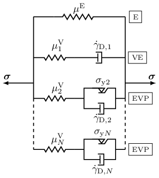

# VEVP Zhao 2021

[`VEVP_Zhao2021_AD`](@ref) and [`VEVP_Zhao2021_AT`](@ref) are two finite-strain viscoelastic–viscoplastic implementations after Zhao et al. [1].
The implementations are available in `src/models/VEVP_Zhao2021_AD.jl` and `src/models/VEVP_Zhao2021_AT.jl`.
They use a generalized Maxwell framework with one elastic module and multiple inelastic modules in parallel, with yield-threshold softening and an evolving inelastic shear modulus.
Figure 1 sketches the parallel elastic, viscoelastic, and elasto-viscoplastic module layout used by the model.



**Figure 1.** *Rheological representation of the VEVP Zhao 2021 model with one elastic module, one viscoelastic module, and elasto-viscoplastic modules in parallel.*

The two implementations share the same 14 positional constructor arguments plus the optional `dt_scale` keyword.
`VEVP_Zhao2021_AD` obtains the algorithmic tangent by automatic differentiation and supports the generic `PlaneStrain` / `PlaneStress` wrapper path.
`VEVP_Zhao2021_AT` uses a pre-derived analytical tangent in the 3D assemble-time path, with per-QP branch tensors stored as Tensors.jl `SymmetricTensor{2,3,Float64,6}` values.
They are **not interchangeable**:
`VEVP_Zhao2021_AD` assembles the final PK2 stress from the converged updated branch state, while `VEVP_Zhao2021_AT` follows the analytical-tangent reference path and assembles it from trial branch stresses.
Switching variants for the same load case therefore changes the PK2 stress output.

### Mathematical formulation

Zhao et al. [1] use a generalized Maxwell framework for finite viscoelasticity [2] with one elastic module and $N_\mathrm{V}$ inelastic modules in parallel.
With the common setting `τcut₁ = 0`, the first inelastic module is viscoelastic as its initial effective yield stress is zero; positive `τcut₁` gives that module an initial yield threshold.
The remaining modules are elasto-viscoplastic.
Softening works through a decrease of the effective yield stress with the maximum deformation reached so far.

The stress below is written in second Piola-Kirchhoff (PK2) form, using the deformation gradient $\boldsymbol{F}$, the right Cauchy-Green tensor $\boldsymbol{C}=\boldsymbol{F}^{\mathrm{T}}\boldsymbol{F}$, the volume ratio $J=\det\boldsymbol{F}$, and one inelastic right Cauchy-Green tensor $\boldsymbol{C}_{\mathrm{i},j}$ for each module.
Here, $\mathrm{i}$ labels the inelastic tensor, $j=1,\ldots,N_\mathrm{V}$ labels the inelastic module, and $n$ is the time step index.
Throughout this page, $\operatorname{dev}(\cdot)$ denotes the deviatoric part and $\|\cdot\|_\mathrm{F}$ denotes the Frobenius norm.

#### 1. Stress evaluation

Using $\boldsymbol{C} = \boldsymbol{F}^{\mathrm{T}}\boldsymbol{F} \text{,}$ $J = \det\boldsymbol{F} \text{,}$ and $\boldsymbol{C}^* = J^{-2/3}\,\boldsymbol{C} \text{,}$ the implemented PK2 stress reads as

```math
\boldsymbol{S}
=
\kappa J\left[J-1\right]\boldsymbol{C}^{-1}
+ \mu^{\mathrm{E}} \boldsymbol{C}^{-1}\operatorname{dev}(\boldsymbol{C}^*)
+ \sum_{j=1}^{N_\mathrm{V}}
\mu^{\mathrm{V}}_j \boldsymbol{C}^{-1}
\operatorname{dev}(\boldsymbol{C}^*\boldsymbol{C}_{\mathrm{i},j}^{-1}) \text{.}
```

Here, $\mu^{\mathrm{E}}$ is the elastic shear modulus, $\kappa$ is the total bulk modulus, $\mu^{\mathrm{V}}$ is the current total inelastic shear modulus, and $\mu^{\mathrm{V}}_j$ is the part assigned to module $j$.
While Zhao et al. [1] use the uniform assignment $\mu^{\mathrm{V}}_j=\mu^{\mathrm{V}}/N_\mathrm{V}$, this implementation also supports a linear module distribution through the constructor argument `μVN`, which sets the module-$N_\mathrm{V}$ endpoint $\mu^{\mathrm{V}}_{N_\mathrm{V}}$.
When `μVN` is close to zero, the uniform assignment $\mu^{\mathrm{V}}/N_\mathrm{V}$ is used; otherwise the module moduli are linearly distributed and still sum to $\mu^{\mathrm{V}}$.

#### 2. Viscoplastic flow
The module flow is driven by the deviatoric norm of the pushed-forward trial module stress

```math
\boldsymbol{\tau}^{\mathrm{tr}}_j
=
\boldsymbol{F}\boldsymbol{S}^{\mathrm{tr}}_j\boldsymbol{F}^{\mathrm{T}} \text{.}
```
Here, $\boldsymbol{S}^{\mathrm{tr}}_j$ is the trial PK2 stress contribution of inelastic module $j$, and $\boldsymbol{\tau}^{\mathrm{tr}}_j$ is its pushed-forward trial stress.

The history variable stored as `strain_maxk` is the maximum principal stretch ratio measure of Zhao et al. [1]

```math
v_{\max}(t)
=
\max_{0 \le s \le t}
\left|\frac{\lambda_{\max}(s)}{\lambda_{\min}(s)} - 1 \right| \text{.}
```
Here, $\lambda_{\max}$ and $\lambda_{\min}$ are the largest and smallest principal stretches reached at the history time $s$.

Using the ramp function $\langle x\rangle = \left[x + |x|\right]/2$, the effective yield stress in module $j$ is

```math
r_{\mathrm{y},j}(v_{\max})
=
\left\langle r_{\mathrm{y0},j} - \beta v_{\max} \right\rangle \text{,}
```
with initial module threshold $r_{\mathrm{y0},j}$ and softening coefficient $\beta$.

The effective flow measure evaluated by the implementation is

```math
\dot{\gamma}_{\mathrm{D},j}
=
\left\langle
\frac{\|\operatorname{dev}\boldsymbol{\tau}^{\mathrm{tr}}_j\|_\mathrm{F}}{\hat{\tau}_j}- r_{\mathrm{y},j}(v_{\max}) \right\rangle^{m_j} \text{.}
```

The constructor arguments `τ̂₁` and `τ̂N` set the endpoint values for the $\hat{\tau}_j$ appearing in the denominator of the power-flow law.
The endpoint arguments `m₁` and `mN` set the stress exponent $m_j$ for each module.
The constructor arguments `τcut₁` and `τcutN` set the endpoint values for $r_{\mathrm{y0},j}$ in the effective yield stress $r_{\mathrm{y},j}$.
Setting `τcut₁ = 0` gives $r_{\mathrm{y0},1}=0$; positive values give the first module an initial yield threshold.

#### 3. Inelastic state update
For the stable AD and AT variants, the inelastic tensor is updated over the time increment $\Delta t$ with the semi-implicit, volume-preserving update [3] as

```math
\boldsymbol{C}^{\mathrm{nd}}_{\mathrm{i},j,n+1}
=
\boldsymbol{C}_{\mathrm{i},j,n}
+ \Delta t\,
\frac{\dot{\gamma}_{\mathrm{D},j}}{\|\operatorname{dev}\boldsymbol{\tau}^{\mathrm{tr}}_j\|_\mathrm{F}}
\mu^{\mathrm{V}}_j \boldsymbol{C}^* \text{,}
```
The superscript $\mathrm{nd}$ marks the intermediate inelastic tensor before determinant normalization, while the normalized end-of-step tensor is

```math
\boldsymbol{C}_{\mathrm{i},j,n+1}
=
\det(\boldsymbol{C}^{\mathrm{nd}}_{\mathrm{i},j,n+1})^{-1/3}
\boldsymbol{C}^{\mathrm{nd}}_{\mathrm{i},j,n+1}\text{.}
```

If the trial stress norm is zero, the prefactor $\dot{\gamma}_{\mathrm{D},j}/\|\operatorname{dev}\boldsymbol{\tau}^{\mathrm{tr}}_j\|_\mathrm{F}$ is taken as zero.
The determinant normalization enforces the isochoric-inelastic assumption used in Zhao et al. [1].
The AD implementation additionally floors $\det\boldsymbol{C}$, principal stretch eigenvalues, and the $\boldsymbol{C}_{\mathrm{i},j,n+1}$ determinant normalizer for differentiability and numerical guards; the AT implementation does not apply those AD-only caps.

#### 4. Additional shear modulus evolution in this implementation
In addition to the yield stress softening criterion of Zhao et al. [1], the implementation evolves the total inelastic shear modulus as

```math
\mu^{\mathrm{V}}_{n+1}
=
\mu^{\mathrm{V}}_n
+ \alpha\left[\mu^{\mathrm{Ve}} - \mu^{\mathrm{V}}_n\right]\dot{\gamma}_{\mathrm{D},1}\Delta t \text{.}
```

Here, $\alpha$ controls the evolution rate, $\mu^{\mathrm{Ve}}$ is the target total inelastic shear modulus, and $\dot{\gamma}_{\mathrm{D},1}$ is the flow measure of the first inelastic module.
The updated total $\mu^{\mathrm{V}}_{n+1}$ is stored for the next step.
Critically, `VEVP_Zhao2021_AD` redistributes the updated total modulus before final stress assembly, while `VEVP_Zhao2021_AT` follows the analytical-tangent path and evaluates final stress from the trial branch stresses.

## Implementation details

### State variables
Both Zhao variants track the maximum principal stretch $v_{\max}$, the total inelastic shear modulus $\mu^{\mathrm{V}}$, and one inelastic right Cauchy-Green tensor $\boldsymbol{C}_{\mathrm{i},j}$ per module $j$ in a trial/commit state pair.

The AD variant uses `VEVP_Zhao2021_ADState` as the trial/commit state wrapper.
The internal state type `VEVP_Zhao2021_ADStateInternal` stores the forward per-module tensors `Cik` as `SymmetricTensor{2,3,Float64,6}` and recomputes their inverses as needed.
This stores ``\left[6 NV + 2\right] × 2`` `Float64` values per quadrature point.

The AT variant uses `VEVP_Zhao2021_ATState` as the trial/commit state wrapper.
The internal state type `VEVP_Zhao2021_ATStateInternal` additionally caches the inverse tensors `Cik_inv` and the unnormalized next-step tensors `Cikp1_nd` to support the analytical tangent.
This stores ``\left[18 NV + 2\right] × 2`` `Float64` values per quadrature point.

### Tangent and stress formulations
Two formulations are provided:

1. **`VEVP_Zhao2021_AD`**: Evaluates the stress at the **converged** updated state.
The tangent is obtained via automatic differentiation (`Tensors.gradient`) over the local update `compute_PK1_3D`.
2. **`VEVP_Zhao2021_AT`**: Evaluates the stress using the **trial** state.
The tangent is an analytical stiffness matrix from [4], assembled from nodal shape-gradient blocks in a custom `_assemble_element!` method.
It is the package's primary example of a model that implements the element-level assembly hook (`_assemble_element!`) directly, as its node-block tangent structure cannot be expressed as the quadrature point `∂P/∂F` which the generic element routine exercises.

!!! warning "Non-interchangeable formulations"
    Since `VEVP_Zhao2021_AD` uses the updated branch state and `VEVP_Zhao2021_AT` uses the trial branch state, they return different stresses for the same deformation step.
    The analytical tangent is finite-difference consistent while flow is inactive, but not once flow is active, so `VEVP_Zhao2021_AT` needs more Newton iterations per load step and tolerates a smaller load step than `VEVP_Zhao2021_AD`.

!!! warning "2D wrapper limitation"
    `VEVP_Zhao2021_AT` supports `PlaneStrain` through a separate analytical tangent assembly path, but does not support `PlaneStress` or the generic wrapper AD path.
    `VEVP_Zhao2021_AD` also supports plane stress analyses.

### Local integration
`solve_local_vevp_zhao_exact` performs a semi-implicit update:
1. Kinematics: $\boldsymbol{C}=\boldsymbol{F}^{\mathrm{T}}\boldsymbol{F}$ and $\boldsymbol{C}^*=\left[\det\boldsymbol{C}\right]^{-1/3}\,\boldsymbol{C}$.
2. Compute the trial deviatoric stress in each inelastic module.
3. Evaluate the ramped power-flow measure $\gamma_{\mathrm{D},j}$.
4. Update the volume-preserving per-module `Cik` tensors via a closed-form push-forward (no local Newton–Raphson iteration).
5. Update the total inelastic shear modulus $\mu^{\mathrm{V}}_{n+1}$.
6. Assemble the stress from the updated branch state for AD, or from the trial branch stresses for AT.

In the AT stiffness assembly, the internal helper `gamma_D` stores a normalized flow prefactor after the local update.
This is an implementation detail of the analytical tangent and should not be interpreted as the raw power-flow measure $\dot{\gamma}_{\mathrm{D},j}$ used in the equations above.

## Constructor

```julia
VEVP_Zhao2021_AD(μE, κ, NV, β, α, μVe, μVN, τ̂₁, τ̂N, m₁, mN, τcut₁, τcutN, μV; dt_scale=1.0)
VEVP_Zhao2021_AT(μE, κ, NV, β, α, μVe, μVN, τ̂₁, τ̂N, m₁, mN, τcut₁, τcutN, μV; dt_scale=1.0)
```

Both constructors require `NV >= 2`.
Each per-module parameter (`τ̂_j`, `m_j`, `r_y0,j`, `μV_j`) is interpolated between its module-1 and module-`N_V` endpoint values; for `μV_j` the interpolation is uniform when `μVN` is near zero and linear otherwise.

!!! info "Time-unit scaling (`dt_scale` kwarg)"
    `dt_scale` multiplies `dt` inside the constitutive update so the time step is always expressed in the unit used during parameter calibration.
    Default `1.0`: leave it alone when the driver's `dt` already uses that unit.
    When the calibration unit and the driver unit differ, set it to the conversion factor – e.g. parameters calibrated in seconds but the driver passes `dt` in nanoseconds → `dt_scale = 1e-9`.

## 2D usage

The two variants differ in wrapper support.
`VEVP_Zhao2021_AD` supports both wrappers through its own `compute_PK1_3D` and `update_state_from_3D!` methods, which the generic wrapper path differentiates:

```julia
material = PlaneStress(VEVP_Zhao2021_AD(μE, κ, NV, β, α, μVe, μVN, τ̂₁, τ̂N, m₁, mN, τcut₁, τcutN, μV))
material = PlaneStrain(VEVP_Zhao2021_AD(μE, κ, NV, β, α, μVe, μVN, τ̂₁, τ̂N, m₁, mN, τcut₁, τcutN, μV))
```

`VEVP_Zhao2021_AT` supports plane strain only, through a custom `_assemble_element!` method that embeds the in-plane deformation gradient with `F33 = 1` and assembles the analytical tangent from embedded shape gradients:

```julia
material = PlaneStrain(VEVP_Zhao2021_AT(μE, κ, NV, β, α, μVe, μVN, τ̂₁, τ̂N, m₁, mN, τcut₁, τcutN, μV))
```

Use `VEVP_Zhao2021_AD` for plane stress analyses.
`PlaneStress(VEVP_Zhao2021_AT(...))` throws an `ArgumentError` at assembly because the analytical tangent implementation is `Float64`/matrix-based and is not transparent to the AD used by the generic wrapper path.

For wrapper mechanics, see [Wrappers](../wrappers.md).

## Model parameters

| Group | Constructor argument | Symbol | Description |
| --- | --- | --- | --- |
| Elasticity | `μE` | $\mu^{\mathrm{E}}$ | Elastic branch shear modulus |
| Elasticity | `κ` | $\kappa$ | Bulk modulus |
| Module layout | `NV` | $N_\mathrm{V}$ | Number of inelastic modules (requires $N_\mathrm{V} \geq 2$) |
| Yield softening | `β` | $\beta$ | Yield-threshold softening coefficient; larger values drop the threshold sooner |
| Shear modulus evolution | `α` | $\alpha$ | Inelastic shear modulus evolution rate; higher values approach μVe faster |
| Shear modulus evolution | `μVe` | $\mu^{\mathrm{Ve}}$ | Target total inelastic shear modulus approached by the μV evolution |
| Module modulus distribution | `μVN` | $\mu^{\mathrm{V}}_{N_\mathrm{V}}$ | Module-$N_\mathrm{V}$ shear modulus endpoint; near zero gives uniform modules |
| Module interpolation | `τ̂₁`, `τ̂N` | $\hat{\tau}_1$, $\hat{\tau}_{N_\mathrm{V}}$ | Flow-resistance stress-scale endpoints in the power-flow law; larger values reduce the viscoplastic flow rate |
| Module interpolation | `m₁`, `mN` | $m_1$, $m_{N_\mathrm{V}}$ | Stress exponents in the power-flow law; larger values increase the nonlinearity of the viscoplastic rate |
| Module interpolation | `τcut₁`, `τcutN` | $r_{\mathrm{y0},1}$, $r_{\mathrm{y0},N_\mathrm{V}}$ | Initial yield thresholds for the modules; subtracted from the trial-stress ratio before the power-law ramp |
| Initial state | `μV` | $\mu^{\mathrm{V}}_0$ | Initial total inelastic shear modulus |

## Provenance and acknowledgements

The code-level reference is the CAPRICCIO/VEVP implementation [4].
Wuyang Zhao confirmed that the Julia translation/adaptation may be distributed as part of FerriteSolidMechanics.jl under the MIT license, and that he can grant this permission for the relevant CAPRICCIO/VEVP model rights holders.

The implementation is maintained by Lukas Laubert.
Wuyang Zhao is gratefully acknowledged for providing the reference implementation and rheological layout figure, for proofreading this page, and for clarifying details about the model formulation and parameterization.

## Main differences from the reference

The CAPRICCIO/Zhao code-level reference [4] provides a hand-derived analytical stiffness matrix and evaluates the final PK2 stress from the **trial** branch state `SV_trial{j}`.
The `VEVP_Zhao2021_AT` variant preserves this trial-state analytical-tangent formulation, but stores its branch tensors in Tensors.jl `SymmetricTensor{2,3,Float64,6}` form.
Consequently, products such as $\boldsymbol{C}^*\boldsymbol{C}_{\textrm{i},j}^{-1}$ are symmetrized at the storage boundary.
However, the archived Matrix-storage version `VEVP_Zhao2021_AT_Matlab` and the original MATLAB routines keep the full intermediate matrix.
For coaxial or identity branch states this difference is round-off level.
For non-coaxial active-flow samples, single-quadrature point checks showed changes up to the second decimal place in off-diagonal PK2 components.
Besides, the `VEVP_Zhao2021_AD` variant differs in three implementation choices:

- The tangent is obtained via automatic differentiation (`Tensors.gradient` over the PK1 wrapper).
- The final PK2 stress is evaluated at the **converged** branch state $\boldsymbol{C}_{\mathrm{i},j,n+1}$.
- Small determinant and principal stretch floors are applied in the AD path.

The two variants return different PK2 stresses for the same input; they are not interchangeable.

## See also

- Experimental variants, including an archived Matrix-storage AT port: `VEVP_Zhao2021_AD_Simplified`, `VEVP_Zhao2021_AT_Matlab` (see [Experimental models](../experimental.md)).

## References

[1] Zhao, W., Ries, M., Steinmann, P., & Pfaller, S. (2021). A viscoelastic–viscoplastic constitutive model for glassy polymers informed by molecular dynamics simulations. *International Journal of Solids and Structures*, 226–227, 111071. [doi:10.1016/j.ijsolstr.2021.111071](https://doi.org/10.1016/j.ijsolstr.2021.111071)

[2] Reese, S., & Govindjee, S. (1998). A theory of finite viscoelasticity and numerical aspects. *International Journal of Solids and Structures*, 35(26–27), 3455-3482. [doi:10.1016/S0020-7683(97)00217-5](https://doi.org/10.1016/S0020-7683(97)00217-5)

[3] Shutov, A., Landgraf, R., & Ihlemann, J. (2013). An explicit solution for implicit time stepping in multiplicative finite-strain viscoelasticity. *Computer Methods in Applied Mechanics and Engineering*, 265, 213-225. [doi:10.1016/j.cma.2013.07.004](https://doi.org/10.1016/j.cma.2013.07.004)

[4] Pfaller, S., Ries, M., Zhao, W., Bauer, C., Weber, F., & Laubert, L. (2024). *CAPRICCIO - Tool to run concurrent Finite Element-Molecular Dynamics Simulations* (Version 2.0.1) [Software]. Zenodo. [doi:10.5281/zenodo.12606758](https://doi.org/10.5281/zenodo.12606758).