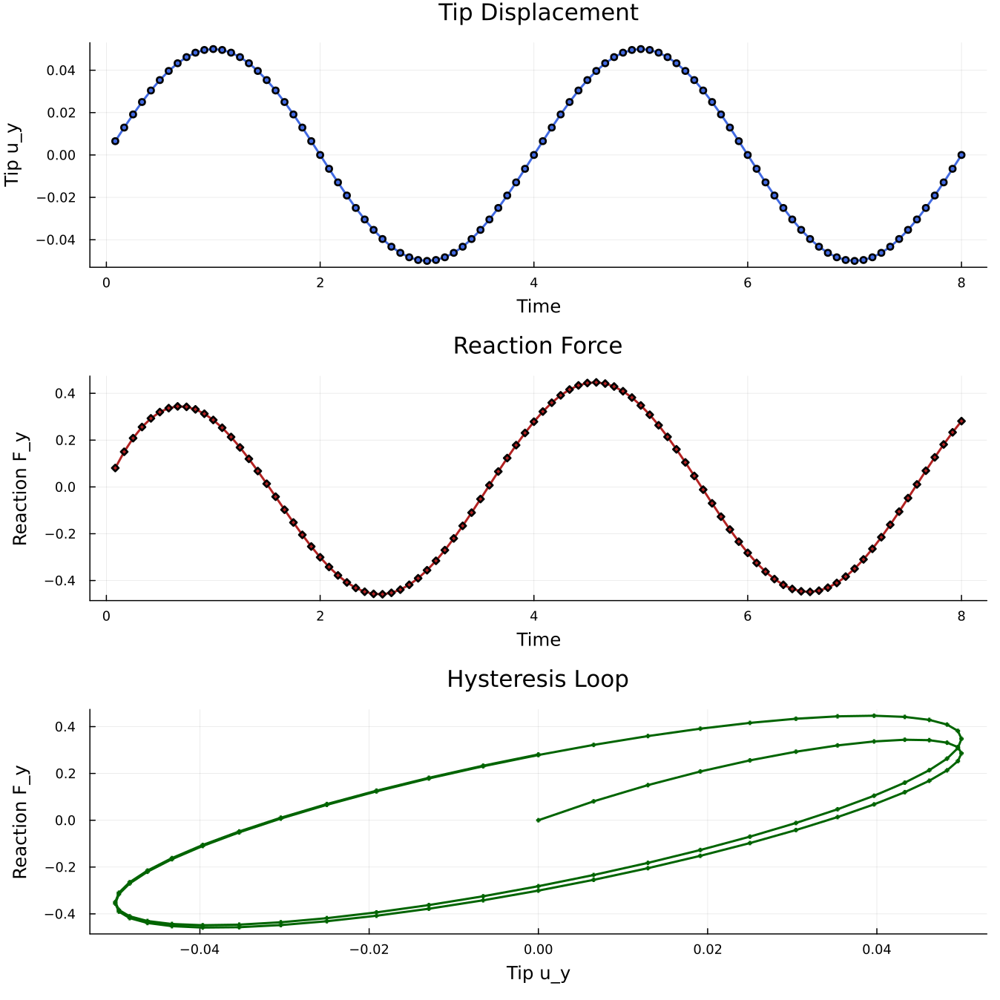

# DMA cantilever beam

A 3D cantilever beam under sinusoidal, displacement-controlled loading, solved with the `VEVP_MOAMMM` viscoelastic-viscoplastic model.
The runnable script is `examples/cantilever_beam_dma.jl` and can be executed from the repository root with:

```sh
julia --project=. examples/cantilever_beam_dma.jl
```

The direct run writes plot and VTK output.
Install `Plots.jl` and `WriteVTK.jl` in the active environment before running it with output enabled.

For a short run without plot or VTK output, start Julia with `julia --project=.` and run:

```julia
include("examples/cantilever_beam_dma.jl")
result = run_cantilever_beam_dma(; nx=3, ny=1, nz=1, nsteps=4, vtk=nothing)
println("converged steps: ", result.converged_steps)
```

## Problem setup

The beam extends along the x-axis from the clamped root at `x = 0` to the controlled tip at `Lx`.
The root face is fixed in all three displacement directions.
The tip face is fixed in x and z, while the y-displacement follows `u_y = A sin(4*pi*t/total_time)`.

This prescribed displacement creates a cyclic loading-unloading path.
The force-displacement loop in Figure 1 shows the phase lag and indicates energy dissipation of the viscoelastic response.


**Figure 1.** *Hysteresis loop showing viscoelastic response of the cantilever.*

## Grid, interpolation, constraints

We set up a 3D hexahedral beam, a quadratic displacement field, and the two Dirichlet boundaries with standard Ferrite.jl calls:

```julia
nx, ny, nz = 8, 2, 2                              # default mesh resolution
Lx, Ly, Lz = 5.0, 1.0, 1.0                        # beam dimensions
grid = generate_grid(Hexahedron, (nx, ny, nz), Vec(0.0, 0.0, 0.0), Vec(Lx, Ly, Lz)) # create the beam mesh

interpolation = Serendipity{RefHexahedron, 2}()^3 # quadratic displacement shape functions in 3D
dh = DofHandler(grid)                             # create the dof handler for the grid
add!(dh, :u, interpolation)                       # add displacement dofs under the field name `:u`
close!(dh)                                        # finalize the dof numbering

amplitude = 0.05                                  # prescribed tip-displacement amplitude
total_time = 8.0                                  # duration of two loading cycles
ch = ConstraintHandler(dh)                        # collect Dirichlet boundary conditions
add!(ch, Dirichlet(:u, getfacetset(grid, "left"),  (x, t) -> [0.0, 0.0, 0.0], [1, 2, 3])) # clamp the root
add!(ch, Dirichlet(:u, getfacetset(grid, "right"), (x, t) -> [0.0, amplitude * sin(4.0 * pi * t / total_time), 0.0], [1, 2, 3])) # drive the tip in y
close!(ch)                                        # finalize the constraint data
```

For the tip reaction, only the y-component displacement DOFs on the right face are collected:

```julia
function _facet_component_dofs(dh, facets, interpolation, component)
    ncomp = Ferrite.n_components(interpolation)     # number of vector components in :u
    base_interpolation = Ferrite.get_base_interpolation(interpolation) # scalar shape functions behind the vector field
    facet_dofs = Ferrite.dirichlet_facetdof_indices(base_interpolation) # local scalar dofs on each facet
    facet_cache = FacetCache(dh)                    # reusable cache for cell/facet dof lookup
    dofs = Int[]                                    # collected global dof numbers

    for facet in facets
        reinit!(facet_cache, facet)                 # load the current boundary facet
        _, facet_id = facet                         # local face number in the current cell
        for local_shape_dof in facet_dofs[facet_id] # scalar shape dofs on this face
            local_component_dof = (local_shape_dof - 1) * ncomp + component # select component 2, i.e. y
            push!(dofs, celldofs(facet_cache)[local_component_dof]) # map local dof to global dof
        end
    end

    sort!(dofs)                                     # neighboring facets share edge/corner dofs
    unique!(dofs)                                   # keep each reaction dof once
    return dofs
end

react_dofs = _facet_component_dofs(dh, getfacetset(grid, "right"), interpolation, 2) # right-face y dofs
```

`react_dofs` is only used to extract the reaction force from the residual vector before constrained entries are zeroed.
It does not affect assembly or the actual Dirichlet constraints.

## Material

We apply `VEVP_MOAMMM` with eight bulk and eight shear Maxwell branches:

```julia
mat = VEVP_MOAMMM(
    6, 80.0, 40.0, 0.25, 0.3, 2.0, 1.0,
    40.0, 10.0, 5.0, 1.0, 45.0, 10.0, 5.0, 1.0,
    1.0, 0.1, 0.01,
    [60.0, 70.0, 80.0, 90.0, 100.0, 110.0, 120.0, 130.0],
    [0.2625, 0.3375, 0.4125, 0.4875, 0.60, 0.75, 0.9375, 1.20],
    [60.0, 70.0, 80.0, 90.0, 100.0, 110.0, 120.0, 130.0],
    [0.2625, 0.3375, 0.4125, 0.4875, 0.60, 0.75, 0.9375, 1.20],
)
```

The relaxation times are chosen near the loading period to cause a significant phase lag.
With the default amplitude and parameters, the response stays in the viscoelastic range, so the visible hysteresis is driven by the Maxwell branches rather than by plastic flow.
See [VEVP MOAMMM](@ref "VEVP MOAMMM") for the parameter glossary.

## Assembler

`create_assembler` combines the material, dof handler, and constraints into the reusable FerriteSolidMechanics object:

```julia
assembler = create_assembler(mat, dh, ch; quadrature_order=2)
```

The assembler stores one material state per quadrature point of each nonlinear cell and reuses its global stiffness matrix, residual vector, and per-cell element matrices/vectors across time steps.

## Time and Newton loop

The prescribed tip displacement is advanced in equal physical time steps.
`stiffness_matrix` evaluates the material response for the current trial displacement, and `update_states!(assembler)` commits the converged material state:

```julia
u = zeros(ndofs(dh))                    # allocate the displacement vector
nsteps = 96                             # number of equal physical time steps
max_newton = 180                        # maximum Newton iterations per time step
newton_tol = 1e-6                       # residual tolerance
dt = total_time / nsteps                # physical time increment

for step in 1:nsteps                    # advance the imposed displacement
    t = step * dt                       # current physical time
    update!(ch, t)                      # update the sinusoidal boundary value
    apply!(u, ch)                       # write prescribed displacements into `u`

    for iter in 1:max_newton            # Newton iterations for this time step
        K, r = stiffness_matrix(assembler, u; dt=dt) # constitutive evaluation and tangent/residual assembly
        fy_tip = isempty(react_dofs) ? 0.0 : sum(r[react_dofs]) # exract reaction before constrained dofs are zeroed
        apply_zero!(K, r, ch)           # apply constraints for constrained solving
        if norm(r) < newton_tol         # stop once the residual is small enough
            break
        end
        u .-= K \ r                     # update the displacement vector
    end
    update_states!(assembler)           # commit material states after convergence
end
```

Here, `dt` is the physical time increment of the sinusoidal loading.
Because `VEVP_MOAMMM` is strain rate-dependent, this value enters the local viscoelastic-viscoplastic update and affects the result.

The tip reaction must be read before `apply_zero!`.
After `apply_zero!`, the constrained residual entries are overwritten to consider the Cirichlet boundary conditions and no longer contain the reaction force.

## Postprocessing

We record three histories at each converged step: time `t`, tip displacement `u_y`, and tip reaction `F_y`.
After the last step, `compute_stresses` evaluates the Cauchy stress field:

```julia
stresses = compute_stresses(assembler, u)
```

`phase_lag_degrees(result)` estimates the first-harmonic phase lag between tip displacement and reaction force.
`plot_results(result)` writes a three-panel figure with displacement history, reaction history, and the hysteresis loop.

With the default settings, the direct run prints a short summary similar to:

```text
Solved 3D cantilever beam DMA
  cells: 32
  dofs: 783
  converged steps: 96
  peak tip uy: 0.05
  force/displacement phase lag: 38.92 degrees
  stress entries: 256
```

Output files are written to `examples/results/cantilever_beam_dma/` when plotting or VTK output is enabled.

## Swapping the material model

The solve loop above can drive any material model that is a subtype of `AbstractMaterial`.
To swap `VEVP_MOAMMM` for another material model, change only the material constructor:

```julia
# Same script, different material:
mat = J2Plasticity(70e3, 0.3, 250.0, 1e3)
mat = VEVP_Zhao2021_AD(1e3, 1e3, 8, 0.1, 0.5, 0.8, 0.5, 1e-3, 1.0, 2.0, 4.0, 0.0, 0.5, 1.0)
```

The assembler calls the new material's element routine and state-update methods through the same interface.

## Plain program

The full runnable source is rendered from `examples/cantilever_beam_dma.jl`:

```@eval
using Markdown
import FerriteSolidMechanics
path = joinpath(pkgdir(FerriteSolidMechanics), "examples", "cantilever_beam_dma.jl")
Markdown.parse("```julia\n" * read(path, String) * "\n```")
```