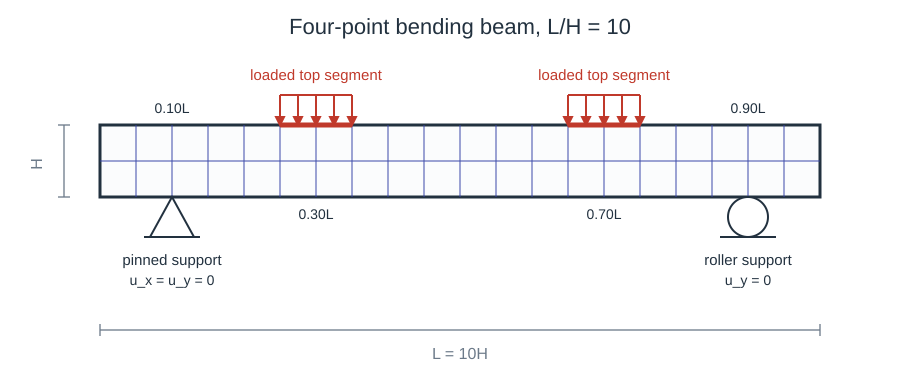

# MPI four-point bending

A 2D plane strain four-point-bending beam using `VEVP_Zhao2021_AD`, solved with FerriteSolidMechanics' threaded and MPI assembly paths.
The runnable script is `examples/mpi_four_point_bending.jl`; the SLURM submission script is `examples/submit_four_point_bending.sh`.

Run the one-rank script from the repository root with:

```sh
julia --project=. examples/mpi_four_point_bending.jl
```

Run the same script through MPI with:

```sh
mpiexec -n 4 julia --project=. --threads=1 examples/mpi_four_point_bending.jl
```

The script's `main()` initializes MPI before calling the example function.
Without `mpiexec`, this is a single-rank MPI run.
The direct run writes PVD/VTU output and therefore requires `WriteVTK.jl` in the active environment.
For a no-output run that avoids `WriteVTK.jl`, include the script and call `main(; vtk=nothing)`:

```sh
julia --project=. --threads=1 -e "include(ARGS[1]); main(; vtk=nothing)" examples/mpi_four_point_bending.jl
```

## Problem setup

In its default configuration, the beam is under plane strain with aspect ratio `L/H = 10`.
Its structured quadrilateral mesh spans `L x H` and contains `nx = 10*density` and `ny = density` elements with `density = 4` as the default value.
As shown in Figure 1, the supports and loads are applied on four boundary segments:

- `support_left`: bottom edge at `x = 0.10L`, pinned with `u_x = u_y = 0`,
- `support_right`: bottom edge at `x = 0.90L`, roller support with `u_y = 0`,
- `load_left`: top edge at `x = 0.30L`, downward traction,
- `load_right`: top edge at `x = 0.70L`, downward traction.

The load history ramps from zero to full load, holds the full load, unloads immediately to zero, and then keeps a zero-load recovery phase.
The load is applied as a surface traction integrated over the two top boundary segments, ensuring well-posed boundary conditions across mesh refinements.


**Figure 1.** *Four-point bending setup with pinned and roller supports, and loaded top segments.*

## Grid, interpolation, constraints, loads

The example creates the mesh, boundary facetsets, displacement field, supports, and load integration data with standard Ferrite.jl calls (this setup is identical to a serial run; see [2D plate with a hole](@ref) for a detailed walkthrough):

```julia
density = 4                                        # mesh density parameter
beam_length = 10.0                                 # beam length L
beam_height = 1.0                                  # beam height H
nx = 10 * density                                  # elements along the beam
ny = density                                       # elements along the height
grid = generate_grid(Quadrilateral, (nx, ny), Vec(0.0, 0.0), Vec(beam_length, beam_height)) # create the beam mesh

hx = beam_length / nx                              # element width
half_segment = max(1.01 * hx, 0.025 * beam_length) # segment half-width, at least one facet
on_bottom_segment(x, x0) = isapprox(x[2], 0.0; atol=1e-10) && abs(x[1] - x0) <= half_segment      # true on bottom edge inside the segment
on_top_segment(x, x0) = isapprox(x[2], beam_height; atol=1e-10) && abs(x[1] - x0) <= half_segment # true on top edge inside the segment
addfacetset!(grid, "support_left",  x -> on_bottom_segment(x, 0.10 * beam_length)) # pinned support segment
addfacetset!(grid, "support_right", x -> on_bottom_segment(x, 0.90 * beam_length)) # roller support segment
addfacetset!(grid, "load_left",     x -> on_top_segment(x, 0.30 * beam_length))    # left load segment
addfacetset!(grid, "load_right",    x -> on_top_segment(x, 0.70 * beam_length))    # right load segment

interpolation = Lagrange{RefQuadrilateral,1}()^2  # linear displacement shape functions in 2D
dh = DofHandler(grid)                             # create dof handler for the grid
add!(dh, :u, interpolation)                       # add displacement dofs under the field name `:u`
close!(dh)                                        # finalize the dof numbering

ch = ConstraintHandler(dh)                        # collect support boundary conditions
add!(ch, Dirichlet(:u, getfacetset(grid, "support_left"),  (x, t) -> [0.0, 0.0], [1, 2])) # pinned support
add!(ch, Dirichlet(:u, getfacetset(grid, "support_right"), (x, t) -> [0.0], [2]))         # roller support
close!(ch)                                        # finalize the constraint data

```

The supports are enforced as displacement constraints during every iteration of the Newton loop, while the external traction is assembled once at the beginning of each load step (see [Load and Newton loop](#Load-and-Newton-loop)).

## Material

We employ the 3D `VEVP_Zhao2021_AD` model through a plane strain wrapper:

```julia
material = PlaneStrain(VEVP_Zhao2021_AD(5.0, 20.0, 6, 0.0, 0.0, 283.0, 18.51, 0.1421, 0.6152, 3.0, 3.0, 0.0, 0.0, 283.0))
```

`PlaneStrain` embeds the 2D deformation into the 3D material model and extracts the in-plane response.

## Assembler

We call `create_assembler` exactly as in the serial tutorials:

```julia
assembler = create_assembler(material, dh, ch; quadrature_order=2)
```

The same call works similarly in a non-MPI Julia session, a one-rank MPI run, and a multi-rank MPI run.
When MPI has been initialized, the assembler distributes nonlinear cell work across ranks and reduces the assembled global tangent and internal force vector.

## External load

The downward pressure on the two loading pads is declared on a [`LoadHandler`](@ref), which is built and closed the way the `ConstraintHandler` above is:

```julia
lh = LoadHandler(assembler)              # takes dh, thickness and quadrature orders from the assembler
for name in ("load_left", "load_right")  # both loading pads carry the same pressure
    add!(lh, Traction(name, (x, factor) -> Vec(0.0, -load_pressure * factor))) # downward surface traction
end
close!(lh)                               # resolve the facetsets and validate the load functions
```

The load function receives the quadrature point coordinate `x` and, as its second argument, the factor [`external_forces!`](@ref) is called with.
This example passes a load factor rather than physical time.
Through `x` any spatial profile can be written directly in the load function, for example `Vec(0.0, -load_pressure * factor * x[1] / beam_length)` for a pressure growing linearly along the beam.
See the [External loads](../loads.md) page for the other load types and for the `Pressure` shorthand that applies a traction along the facet normal.

## Load and Newton loop

The load factor is prescribed by an array of converged load steps:

```julia
load_profile = vcat(
    collect(range(1.0 / load_steps, 1.0; length=load_steps)), # ramp up
    fill(1.0, hold_steps),                                    # hold full load
    [0.0],                                                    # immediate unload (replace with a short ramp if too abrupt)
    fill(0.0, recover_steps),                                 # recovery
)
```

At every load step the external force vector is evaluated once, and FerriteSolidMechanics assembles the internal force and tangent inside the Newton loop via `stiffness_matrix`:

```julia
for (step, load_factor) in enumerate(load_profile)            # advance the load history
    f_ext = external_forces!(lh, load_factor)                 # dead load: once per step, not per iteration

    for iter in 1:max_newton                                  # Newton iterations for this load step
        K, f_int_step = stiffness_matrix(assembler, u; dt=dt) # constitutive evaluation and tangent/internal force assembly
        copyto!(f_int, f_int_step)                            # store internal force for output
        residual .= f_int .- f_ext                            # residual with external traction
        apply_zero!(K, residual, ch)                          # apply zero-displacement constraints

        threshold = newton_tol * max(norm(f_ext), 1.0)        # relative residual tolerance
        if norm(residual) <= threshold                        # stop once the residual is small enough
            break
        end
        u .-= K \ residual                                    # update the displacement vector
    end
    update_states!(assembler)                                 # commit material states after convergence
end
```

Because the `VEVP_Zhao2021_AD` model is rate-dependent, the `dt` passed to `stiffness_matrix` is the physical time increment between two entries of `load_profile`.
This example keeps `dt` fixed and calls `stiffness_matrix` directly, which is sufficient for this load case and material parameters.
For simulations where the local material update may fail, replace the assembly call (`stiffness_matrix`) with [`try_stiffness_matrix`](@ref) and reject or retry the whole load step as shown in the [Adaptive time stepping](adaptive_time_stepping.md) tutorial. Fail-recovery must be supported by the material model chosen; see [Feature support](@ref).
Since [`try_stiffness_matrix`](@ref) synchronizes local failures automatically across MPI ranks, the adaptive time stepping loop requires no MPI-specific changes: if `converged = false`, every rank rolls back, reduces `dt`, and retries the same step.

## Postprocessing

The example writes VTK files and a text history only on rank 0.
Stress output is evaluated inside `write_output_step!` when VTK output is enabled:

```julia
stresses = compute_stresses(assembler, u)
```

With the default output path, rank 0 writes `examples/results/mpi_four_point_bending/four_point_bending.pvd`.
Pass `vtk = nothing` to `run_mpi_four_point_bending()` (or `main(; vtk=nothing)`) to disable PVD/VTU output and skip the stress-output pass.

## What MPI changes

The Newton and the outer load loops are the same in serial, threaded, and MPI runs.
The MPI-specific behavior is already handled inside `GenericMaterialAssembler`:

- `create_assembler` assigns nonlinear cells to ranks by a static round-robin rule.
- `stiffness_matrix` evaluates only the rank-owned cells and then reduces the global tangent and internal force vector across ranks.
- `compute_stresses` follows the same ownership-and-reduction pattern for stress output.
- `update_states!` commits only the quadrature states owned by the current rank.

Threading is independent of MPI:
Each rank uses the specified Julia threads to evaluate its owned elements (cells) in parallel during stiffness and stress assembly, while quadrature points within a cell are always evaluated sequentially by the thread processing that cell.

Note that while the constitutive and element-assembly work is distributed, the sparse linear solve is not:
After the reduction, every rank has the full global tangent stiffness matrix `K` and internal force vector `f_int`, constructs the residual, and solves the same system via `K \ residual`.
MPI can only improve runtime when there is enough nonlinear element work per rank to dominate the reduction overhead and rank-replicated solving.

Two solvers are available for that system:

- `K \ residual`, the standard replicated solve this example uses.
  Here, every rank factorizes the full system, so each pays the memory of one factorization.
  It needs no extra packages and measured faster at every 2D grid size.
- [`distributed_solve`](@ref), which splits one factorization across the ranks with MUMPS.
  It requires `import MUMPS` and runs on Unix only.
  In 3D it measured faster at every mesh size above roughly 4k DOFs, by 5.8× at 108k DOFs and 10.2× at 273k, and it uses far less memory per rank.
  See [Distributed solve for large 3D systems](@ref).

This example is 2D and therefore keeps `K \ residual`; the BLAS tuning (`BLAS.set_num_threads`) applies to that solve only.

!!! tip "Speed up the replicated solve"
    BLAS threading helps the replicated solve in 3D, where the linear solve dominates – but only when a rank has the node to itself.
    The example calls `LinearAlgebra.BLAS.set_num_threads(recommended_blas_threads(dh))` once, before the load loop; see [`recommended_blas_threads`](@ref).
    The helper reads the grid dimension and the ranks sharing the node, so it returns `1` for this 2D example, `ncores` for a 3D model on one rank per node, and `1` again as soon as ranks share a node.
    The 2D value is an active setting, not a default: Julia starts BLAS at `Sys.CPU_THREADS ÷ 2`, and on a 72-core node the 2D solve measured 2.61 s per call at 1 thread against 3.38 s at 18 and 3.49 s at 72.

[`recommended_solve_settings`](@ref) returns the solver, rank and thread counts, BLAS threads and estimated memory for a given grid and node, so these rules need not be applied by hand.
For the measurements behind it, by dimension, mesh size and material, see [Performance and parallel execution](@ref).

### MPI troubleshooting

A healthy `mpiexec -n 4` run starts with a single startup line from rank 0 that includes `ranks=4`.
A broken launcher setup may instead print one startup line per process with `ranks=1`; in that case, the launcher is not connected to the MPI library used by MPI.jl.
Before running the full example, this minimal command should print four ranks:

```sh
mpiexec -n 4 julia --project=. --threads=1 -e "using MPI; MPI.Init(); write(stdout, string(:rank, ' ', MPI.Comm_rank(MPI.COMM_WORLD), ' ', '/', ' ', MPI.Comm_size(MPI.COMM_WORLD), '\n')); flush(stdout); MPI.Finalize()"
```

!!! tip "MPI launcher / library mismatch (Linux)"
    If `mpiexec` works on one machine but fails on a cluster during `MPI.Init()`, first check that the launcher and the MPI library loaded by MPI.jl come from the same MPI implementation:

    ```sh
    which mpiexec
    mpiexec --version
    julia --project=. -e 'using MPI; println(MPI.MPI_LIBRARY); println(MPI.mpiexec())'
    ```

    A common failure is launching with system Open MPI while MPI.jl loads MPICH.
    After loading the cluster MPI module, configure MPI.jl to use that system MPI.
    `MPIPreferences` sets this on the environment you launch from, not on FerriteSolidMechanics, so add it to that environment first:

    ```sh
    julia --project=. -e 'using Pkg; Pkg.add("MPIPreferences")'
    julia --project=. -e 'using MPIPreferences; MPIPreferences.use_system_binary(; mpiexec="mpiexec")'
    julia --project=. -e 'using Pkg; Pkg.precompile()'
    ```

    Restart Julia and recheck `MPI.MPI_LIBRARY`.
    If automatic detection cannot find the MPI library, locate `libmpi` with your cluster module tools or `ldconfig -p | grep libmpi`.
    Then pass the full path, for example `library_names=["/path/to/libmpi.so"]`, and set `abi="OpenMPI"` or `abi="MPICH"` to match the loaded module.

!!! tip "MPI launcher / library mismatch (Windows)"
    On Windows, `where mpiexec` may list multiple MPI launchers.

    ```cmd
    where mpiexec
    julia --project=. -e "using MPI; println(MPI.MPI_LIBRARY); println(MPI.mpiexec())"
    ```

    If MPI.jl reports `MicrosoftMPI`, `C:\Program Files\Microsoft MPI\Bin\mpiexec.exe` should appear either as the only entry or before other `mpiexec.exe` entries.
    If it does not, move `C:\Program Files\Microsoft MPI\Bin` earlier in `PATH` (system environment variables), or launch with the full Microsoft MPI `mpiexec.exe` path instead:

    ```cmd
    "C:\Program Files\Microsoft MPI\Bin\mpiexec.exe" -n 4 julia --project=. --threads=1 examples/mpi_four_point_bending.jl
    ```

## Distributed solve for large 3D systems

In the replicated solve, every rank factorizes the full `K` into triangular factors (`K = L·U`), so the solve cost is independent of the node count and those factors must fit within a single node's memory.
In 3D the factors have far more nonzeros than `K` and dominate time and memory; for a large enough mesh they exceed one node's RAM and the solve fails.

[`distributed_solve`](@ref) solves `K * du = residual` with the [MUMPS](https://mumps-solver.org/) distributed sparse direct solver, splitting the factorization across the MPI ranks.
It is a drop-in replacement for the `K \ residual` line in the Newton loop:

```julia
import MUMPS   # loads the FerriteSolidMechanics MUMPS extension; add MUMPS.jl to the environment

# ... inside the Newton loop, after apply_zero!(K, residual, ch):
u .-= distributed_solve(K, residual, MPI.COMM_WORLD)
```

MUMPS is loaded through a package extension, so nothing is installed unless you `import MUMPS`.
This is an opt-in path and Unix/cluster-only.
Every rank calls it with its copy of `K` and `residual`, and all ranks receive the same `du`.
Only the triangular factors are distributed; `K` itself stays replicated on every rank.
The factors use far more memory than `K`, so distributing them is what saves memory.
This, however, does not help once `K` itself exceeds one node's memory.

### When it pays off

In 3D the distributed solve was faster at every mesh size measured.
Measured on NHR@FAU Fritz (72-core nodes), 3D hexahedral NeoHooke, each solver in its own best configuration:

| Grid | Replicated `K \ residual` (1 rank × 72 threads, BLAS 36) | `distributed_solve` (BLAS 1) |
|---|---|---|
| 108k DOFs | 145 s, 20.7 GB | **25.0 s, 2.1 GB** (18 ranks × 4 threads) |
| 273k DOFs | 634 s, 62.5 GB | **62.3 s, 3.4 GB** (36 ranks × 2 threads) |

Both took nine Newton iterations and reached the same solution.
Replicated factors are held per rank, so the 62.5 GB at 273k DOFs is the cost of one rank on a 256 GB node and the total scales with the rank count.
At 556k DOFs one rank needed 179 GB, or 70% of a node.

In 2D the replicated solve was faster, 52 s against 62 s at 291k DOFs, so keep `K \ residual` there.
These thresholds depend on element, mesh and hardware; measure on your own problem before relying on them.

### Launch layout

MUMPS wants **many MPI ranks per node, each with exactly one BLAS thread**, the opposite of the threaded solve (one rank per node, many threads).
Its factorization is communication-heavy, so use a system MPI (for example a cluster's Open MPI module, configured as in [MPI troubleshooting](@ref)) rather than a bundled one.

On a 72-core node, 18–36 ranks were fastest: at 273k DOFs in 3D, 36 ranks × 2 threads took 62 s and 18 ranks × 4 threads took 102 s.
Concentrating the same cores into one rank costs much more: at 47k DOFs, one rank with 72 threads took 89 s against 27 s at 36 ranks × 2 threads.
Critically, two nodes measured slower than one: 123 s for 36 ranks against 102 s for 18, both at 18 ranks per node, and four nodes recovered only to 76 s.
The factorization communicates across the network from the second node onwards, while element assembly keeps scaling with the ranks, from 0.168 s to 0.064 s per Newton iteration over the same 18 to 72 ranks.
Therefore, only add nodes when the factors no longer fit in one node's memory.

!!! warning "Give MUMPS one BLAS thread"
    At 18 ranks, raising the BLAS thread count from 1 to 4 made the solve **6.3× slower**.
    [`recommended_blas_threads`](@ref) already returns 1 for this layout, since it detects the ranks sharing the node.

## Scaling notes

The default `density = 4` configuration has 160 cells.
For `density = d`, the mesh extends to `10d^2` cells.
Increase `density` substantially before timing parallel runs, and set `vtk = nothing` to avoid stress-output and filesystem costs.

`density = 224`, `447` and `894` give 1.0M, 4.0M and 16.0M DOFs.
All three ran on one node with `K \ residual`, in 7.4 s, 30 s and 154 s, at 6.4 GB, 21.9 GB and 95 GB per rank with `Hooke` over one load step.
The rank count has to fall as the mesh grows, here to 9, 4 and 1, because every rank holds its own factorization.
At 16.0M DOFs `distributed_solve` exceeded the node at 18 ranks instead, each of them holding a 4.3 GB copy of `K` before its share of the factorization.
The script prints a synchronized elapsed wall time at the very end on rank 0.

Compare pure threading, pure MPI, and hybrid approaches on the target machine; see [What MPI changes](@ref) for what does and does not get distributed.

## Running locally and on clusters

For a minimal run without `mpiexec` and without VTK output, include the script and call `main` with small settings:

```sh
julia --project=. --threads=1 -e "include(ARGS[1]); main(; density=1, load_steps=1, hold_steps=0, recover_steps=0, vtk=nothing)" examples/mpi_four_point_bending.jl
```

In the following, for running/timing without VTK and stress output, add `-e "include(ARGS[1]); main(; vtk=nothing)"` directly before `examples/mpi_four_point_bending.jl`.

On a single shared-memory node, consider timing one Julia process with several threads, since this assembles in parallel but solves the Newton system only once instead of once per MPI rank:

```sh
julia --project=. --threads=8 examples/mpi_four_point_bending.jl
```

For MPI, start with one Julia thread per rank (see [MPI troubleshooting](@ref) if you encounter issues):

```sh
mpiexec -n 8 julia --project=. --threads=1 examples/mpi_four_point_bending.jl
```

Hybrid MPI/threading is supported: each MPI rank uses its Julia threads to assemble its assigned cells in parallel (see [Threading and MPI](@ref) for the exact ownership rule).
Keep `number_of_ranks * threads_per_rank` within the allocated CPU count:

```sh
mpiexec -n 4 julia --project=. --threads=2 examples/mpi_four_point_bending.jl
```

### SLURM launch

On SLURM, submit the [SLURM submission script](@ref) from the repository root:

```sh
sbatch examples/submit_four_point_bending.sh
```

The submission script was tested on the [NHR@FAU](https://hpc.fau.de/) clusters.
It loads Open MPI and hwloc, configures MPI.jl for the loaded system MPI, instantiates the project, and runs `examples/mpi_four_point_bending.jl` with `srun`.
The default `srun` MPI plugin is `pmix_v3`; set `SRUN_MPI_TYPE` to another value from `srun --mpi=list` if your cluster requires it.
The [SLURM submission script](@ref) disables VTK output in the final `srun` command with `-e 'include(ARGS[1]); main(; vtk=nothing)'`.
Remove the `-e ...` part to write PVD/VTU output, but then ensure `WriteVTK.jl` is available, e.g., with `julia --project=. -e 'using Pkg; Pkg.add("WriteVTK")'`.
Adjust the `#SBATCH` partition, task count, wall time, CPU layout, and `module load` line for your SLURM cluster before running.

## SLURM submission script

The submission script is rendered from `examples/submit_four_point_bending.sh`:

```@eval
using Markdown
import FerriteSolidMechanics
path = joinpath(pkgdir(FerriteSolidMechanics), "examples", "submit_four_point_bending.sh")
Markdown.parse("```sh\n" * read(path, String) * "\n```")
```

## Plain program

The full script is rendered from `examples/mpi_four_point_bending.jl`:

```@eval
using Markdown
import FerriteSolidMechanics
path = joinpath(pkgdir(FerriteSolidMechanics), "examples", "mpi_four_point_bending.jl")
Markdown.parse("```julia\n" * read(path, String) * "\n```")
```
