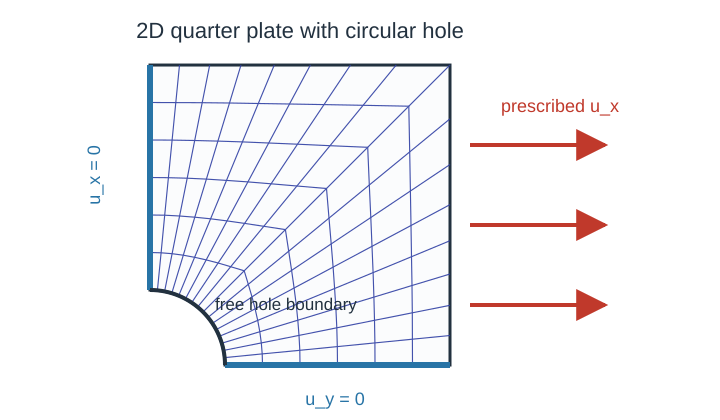
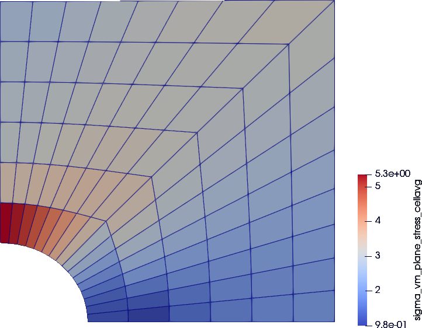

# 2D plate with a hole

A plane stress, displacement-controlled quarter plate with a circular hole, solved with a `NeoHooke` material wrapped by `PlaneStress`.
The runnable script is `examples/plate_with_hole_planestress.jl` and can be executed from the repository root with:

```sh
julia --project=. examples/plate_with_hole_planestress.jl
```

## Problem setup

We model a quarter of a square plate with a quarter-circle hole in the corner.
The plate is `plate_size × plate_size`, the hole has radius `radius`.
For symmetry, the bottom and left edges are clamped in their normal direction; the right edge is displaced uniformly outward and the top edge is left free.
Consequently, the boundary conditions (BCs) follow as

- `y = 0` (bottom edge): `u_y = 0` (symmetry),
- `x = 0` (left edge): `u_x = 0` (symmetry),
- `x = plate_size` (right edge): prescribed `u_x = displacement * t` (loading).

A structured polar-like mesh is generated by the helper `quarter_plate_with_hole_grid`.
Figure 1 shows a schematic of the mesh and the applied BCs.


**Figure 1.** *Setup of the quarter plate with hole including boundary conditions.*

## Grid, interpolation, constraints

We set up the grid, displacement field, and boundary conditions with standard Ferrite.jl calls:

```julia
grid = quarter_plate_with_hole_grid(; nr=6, ntheta=16, radius=0.25, plate_size=1.0) # create the quarter-plate mesh (custom function)

interpolation = Lagrange{RefQuadrilateral,1}()^2 # linear displacement shape functions in 2D
dh = DofHandler(grid)                            # create the dof handler for the grid
add!(dh, :u, interpolation)                      # add displacement dofs under the field name `:u`
close!(dh)                                       # finalize the dof numbering

displacement = 0.03                              # final prescribed right-edge displacement
ch = ConstraintHandler(dh)                       # collect Dirichlet boundary conditions
add!(ch, Dirichlet(:u, getfacetset(grid, "symmetry_x"), (x, t) -> [0.0], [2]))             # bottom symmetry: u_y = 0
add!(ch, Dirichlet(:u, getfacetset(grid, "symmetry_y"), (x, t) -> [0.0], [1]))             # left symmetry: u_x = 0
add!(ch, Dirichlet(:u, getfacetset(grid, "right"),     (x, t) -> [displacement * t], [1])) # right-edge loading: u_x = displacement*t
close!(ch)                                       # finalize the constraint data
```

Each `Dirichlet` call constrains one displacement direction on one facetset.
The right-edge boundary scales linearly with the load parameter `t ∈ [0,1]`.

## Material

A compressible Neo–Hookean material in plane stress is applied using

```julia
E = 100.0
ν = 0.3
material = PlaneStress(NeoHooke(E, ν))
```

The `PlaneStress` wrapper turns the 3D `NeoHooke` into a 2D model by solving for the out-of-plane stretch `F̄₃₃` at every quadrature point and statically condensing the tangent.
It stores the converged out-of-plane stretch so the next local plane stress solve starts from the previous solution.
See [Wrappers](../wrappers.md) for the math.

## Assembler

`create_assembler` is the first FerriteSolidMechanics-specific step: it combines the material, dof handler, and constraints into the reusable object used by the solve loop.

```julia
assembler = create_assembler(material, dh, ch; quadrature_order=2)
```

The assembler stores the material state at each quadrature point and reuses the arrays needed to assemble the global stiffness matrix and internal force vector.

## Load and Newton loop

The prescribed displacement is applied in load steps. `stiffness_matrix` is called inside each Newton iteration and `update_states!(assembler)` commits the final state after Newton converges:

```julia
u = zeros(ndofs(dh))                             # allocate the displacement vector
load_steps = 4                                   # number of equal load increments
max_newton = 20                                  # maximum Newton iterations per load step
newton_tol = 1e-8                                # residual tolerance

for step in 1:load_steps                         # advance the prescribed load
    t = step / load_steps                        # current load factor
    update!(ch, t)                               # update time-dependent boundary values
    apply!(u, ch)                                # write prescribed displacements into `u`

    for _ in 1:max_newton                        # Newton iterations for this load step
        K, r = stiffness_matrix(assembler, u; dt=1.0 / load_steps) # constitutive evaluation & tangent + residual assembly
        apply_zero!(K, r, ch)                    # apply homogeneous constraints to the correction
        if norm(r) < newton_tol                  # stop once the residual is small enough
            break
        end
        u .-= K \ r                              # update the displacement vector
    end
    update_states!(assembler)                    # commit material states after convergence
end
```

The keyword `dt` is the time step by which the material model is evaluated in the current load step.
For strain rate-dependent models, this is the physical time increment.
As `NeoHooke` is rate-independent, using `dt = 1.0 / load_steps` is an arbitrary choice.

`update_states!(assembler)` is called after the load step has converged, which commits the internal material states at each quadrature point.
For the stateless `NeoHooke` used here this is a no-op: `NeoHooke` carries no internal history, so `update_state!` on its `NoState()` does nothing.
The call is kept because it is required for history-bearing models such as `J2Plasticity`, which can be swapped in without changing the loop.

## Postprocessing

`compute_stresses` evaluates stresses from the converged displacement field without advancing material history:

```julia
stresses = compute_stresses(assembler, u)
```

The result is indexed by quadrature point and cell position and contains the in-plane Cauchy stress tensors.

Additionally, this script prints a short summary:

```text
Solved plate with hole
  cells: 96
  dofs: 238
  max displacement: 0.03
  stress entries: 384
```

The final cell-averaged plane stress von Mises stress field from this run is shown in Figure 2.
Note that plotting is not covered in this tutorial due to its focus.



**Figure 2.** *Final cell-averaged von Mises stress field.*

## Swapping the material model

The same Newton loop works with other material models.
To swap `NeoHooke` for another model, change only the material constructor; the assembler, boundary conditions, and postprocessing remain identical:

```julia
# Same script, different material:
material = Hooke2D(E, ν; plane_stress=true) # recommended for linear 2D plane stress
material = PlaneStress(Hooke(E, ν))         # equivalent wrapper path, but more expensive
material = PlaneStrain(J2Plasticity(70e3, 0.3, 250.0, 1e3))  # small-strain plasticity
material = PlaneStress(VEPD_Detrez2010(2000.0, 0.3, 10.0, 5.0, 0.1, 1.0, 1.0, 1.0, 10.0, [100.0, 50.0], [0.1, 1.0]))
```

The same solver forwards `dt` to every material model assigned during assembly.
Rate-independent models such as `J2Plasticity` ignore it; rate-dependent models such as `VEPD_Detrez2010` use it in the local history update.

For pure linear 2D elasticity, prefer `Hooke2D` as it uses the analytical 2D stiffness directly.
Use `PlaneStrain(Hooke)` or `PlaneStress(Hooke)` only when you want the 3D `Hooke` model to go through the same 2D wrapper path as other 3D materials, which lack an analytical 2D implementation.

## Plain program

The full runnable source is rendered from `examples/plate_with_hole_planestress.jl`:

```@eval
using Markdown
import FerriteSolidMechanics
path = joinpath(pkgdir(FerriteSolidMechanics), "examples", "plate_with_hole_planestress.jl")
Markdown.parse("```julia\n" * read(path, String) * "\n```")
```